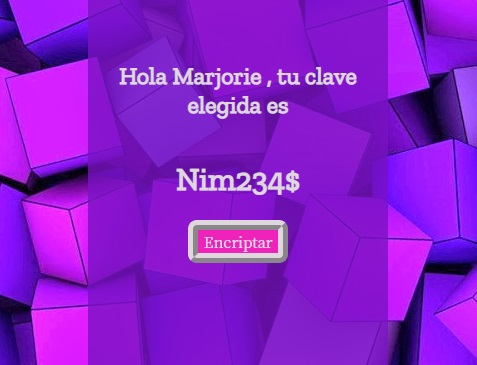

# Aplicativo web que genera una clave segura para los lockers

## ¿Quiénes son los principales usuarios de producto?

Se ha desarrollado un producto digital para las estudiantes de Laboratoria, el cual permite generar una clave segura para los lockers de cada una donde se guarda una laptop asignada.

## ¿Cuáles son los objetivos de estos usuarios en relación con tu producto?

Se han adquirido unos candados sincronizados con el producto digital que se abren cuando se registra la clave encriptada y se cierran con la clave desencriptada con el objetivo de mantener la seguridad de los bienes almacenados en el locker.

## ¿Cómo crees que el producto que estás creando está resolviendo sus problemas?

El usuario registra su usuario y clave que permite el ingreso de letras mayúsculas, minúsculas, números y algunos símbolos.

Por consiguiente, da la bienvenida al usuario y muestra la clave elegida.

Primero, te da la opción de encriptar la clave para abrir el locker. 

Con la clave encriptada tienes la opción de desencriptar la clave para cerrar el locker.Finalmente, te da la opción de volver al inicio para asignar una nueva clave o apoyar a una compañera con el registro de su clave.

El método que se utiliza para encriptar y desencriptar la clave es llamado "Cifrado Cesar" utiliza el cifrado por desplazamiento ya que toma cada caracter de la clave y lo desplaza la cantidad de caracteres ingresado en la caja "offset" ya sea hacia adelante para encriptar o hacia atrás para desencriptar y finalmente, es sustituido por el nuevo carácter. 
